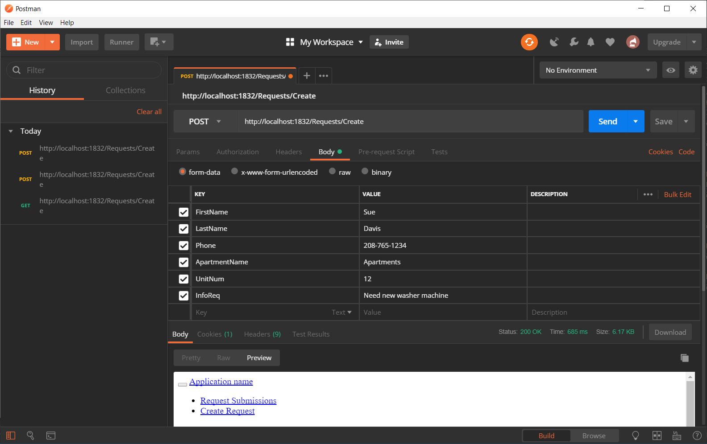
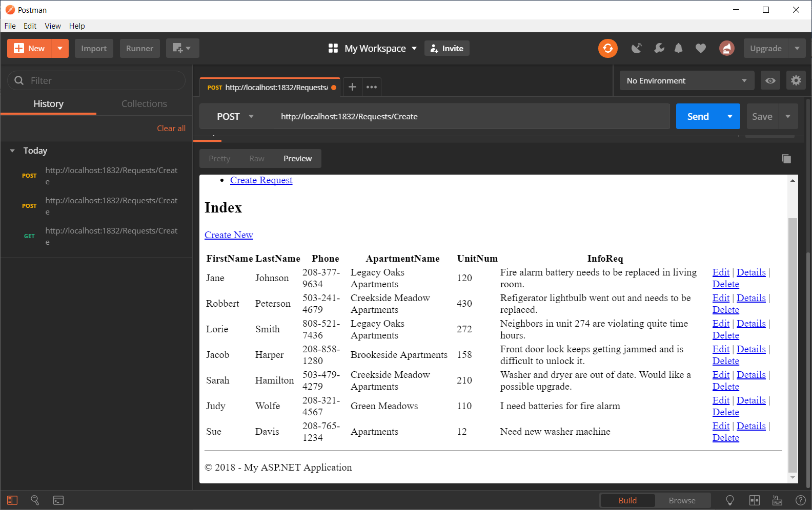

# Homework 5 Blog

## The Assignment

Our primary goals in this assignment were to write an MVC web application that uses a simple one-table local database.  

I want to make a note once again that I am still having the error 404 issue with my project when it is saved and ran from my local repository. I've been working on this with another classmate and we are still working on finding a solution. For now I ran the progam from a folder that is stored outside of my local repository so that I could complete this assignment as well as record the demo.  

Let's begin shall we!  

The first few steps in the homework assignment were to create a home page and then two pages that we could navigate to that were the create a request form page and the page that would hold our table of our database information. Most of that code is similar to that used in homework 4 so I see that there is no need to repost about that section.  

After this we needed to create our database that consist of only one table. We needed to have appropriate data types, fields and have an integer primary key. Below are the three sql queries that I created for adding to the table, dropping the table and selecting all elements in the table to display them.  

Code for up.sql. This is where I created the table (Requests), defined the fields and their data types as well as the primary key and then finished out with inserting values into the table. This is where I inserted 5 entries for the Requests table.
```
CREATE TABLE [dbo].[Requests]
(
	[ID] INT IDENTITY (1,1)		NOT NULL,
	[FirstName]	NVARCHAR(60)			NOT NULL,
	[LastName] NVARCHAR(80)			NOT NULL,
	[Phone]	NVARCHAR(22)			NOT NULL,
	[ApartmentName]	NVARCHAR(64)				NOT NULL,
	[UnitNum] INT						NOT NULL,
	[InfoReq] NVARCHAR(128)			NOT NULL,
	[SubmitTime] DATETIME2			NOT NULL,
	CONSTRAINT [PK_dbo.Requests] PRIMARY KEY CLUSTERED ([ID] ASC)
);

INSERT INTO [dbo].[Requests] (FirstName, LastName, Phone, ApartmentName, UnitNum, InfoReq, SubmitTime) VALUES
	('Jane', 'Johnson', '208-377-9634', 'Legacy Oaks Apartments', 120, 'Fire alarm battery needs to be replaced in living room.', '2018-06-18T10:34:09'),
	('Robbert', 'Peterson', '503-241-4679', 'Creekside Meadow Apartments', 430, 'Refigerator lightbulb went out and needs to be replaced.', '2018-08-18T11:14:16' ),
	('Lorie', 'Smith', '808-521-7436', 'Legacy Oaks Apartments', 272, 'Neighbors in unit 274 are violating quite time hours.', '2018-09-21T09:26:35'),
	('Jacob', 'Harper', '208-858-1280', 'Brookeside Apartments', 158, 'Front door lock keeps getting jammed and is difficult to unlock it.', '2018-10-01T02:13:14'),
	('Sarah','Hamilton', '503-479-4279', 'Creekside Meadow Apartments', 210, 'Washer and dryer are out of date. Would like a possible upgrade.', '2018-10-17T10:15:20')
GO
```   

Code for down.sql. This will drop the table (Requests). Pretty simple.
```
DROP TABLE [dbo].[Requests];
```  

Lastly, there is the code for select.sql. This query will display the table in the message box for Visual Studio. Another simple query to type up.
```
SELECT * from Requests
```  

For the creation of my database, I used Visual Studio's LocalDB that can be accessed  through the Server Explorer tab.  

Next of the list was to create a model class and the database context class. This is when we added a new class to the Model folder and then created a new folder called DAL for our db context class.  

Below is a segment of the code from my Model folder (Request.cs). I included data annotations such as Required (displays a required message if input field wasn't filled in), Display (shows the name of the field in a nicer format) and StringLength (restriction on the string length can be set). In this section of the code it is very important to make sure that the field names (i.e. FirstName etc.) are typed exactly like they are in the query for creating the table. If not, that will cause some problems.
```cs
namespace HW5Version2.Models
{
    public class Request
    {
        public int ID { get; set; }

        [Required]
        [Display(Name = "First Name")]
        [StringLength(20)]
        public string FirstName { get; set; }

        [Required]
        [Display(Name = "Last Name")]
        [StringLength(30)]
        public string LastName { get; set; }

        [Required]
        [StringLength(18)]
        [Display(Name = "Phone")]
        public string Phone { get; set; }
```  

In the DAL folder I added in a new class to create the db context. Below is a copy of the code that was typed into this class. One important note that I want to place here is where it says "name=RequestDB", that is the name that I gave to the local db when I first created it and this name will also be used when I included the connection string in the Web.config file for this project.
```cs
using HW5Version2.Models;
using System;
using System.Collections.Generic;
using System.Data.Entity;
using System.Linq;
using System.Web;

namespace HW5Version2.DAL
{
    public class TenantRequestContext : DbContext
    {
        public TenantRequestContext() : base("name=RequestDB")
        {

        }

        public virtual DbSet<Request> Requests { get; set; }
    }
}  
```  

Here is the segment of code that I added into the Web.config file the make the connection of my MVC app to my local database.
```
<connectionStrings>
    <add name ="RequestDB" connectionString="Data Source=(LocalDB)\MSSQLLocalDB;AttachDbFilename=C:\Users\launi\Documents\CS460\HW5\HW5Version2\HW5Version2\App_Data\RequestDB.mdf;Integrated Security=True" providerName="System.Data.SqlClient" />
  </connectionStrings>
  ```  

  Next for this assignment I created strongly typed views and Razor code to create the UI of my app. For this section of the code I got a lot of help from using the scaffolding. I was struggling at the beginning to format my request page and after going through the scaffolding, I decided that it looked much better after that.  

  To finish out I had download Postman and used it just to check and see if I would be able to post to this program outside of its localhost. After removing the anti-forgery tokens from the scaffolded coded I had success with using Postman. Below are a few snapshots of using Postman.  

Here I am entering in Keys (FirstName, LastName, etc) and Values into Postman.
    

Then after pressing "Send", here is the post result (Sue Davis at the bottom) on the web page in Postman.
  
