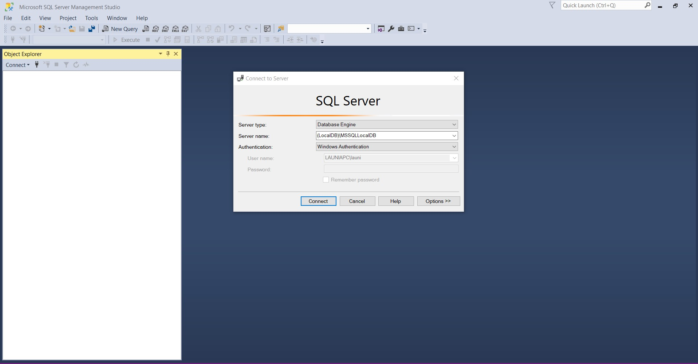
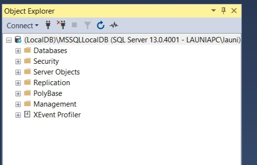
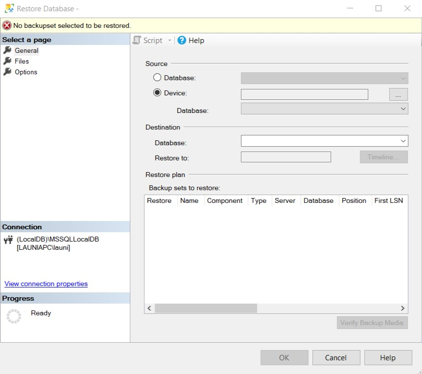
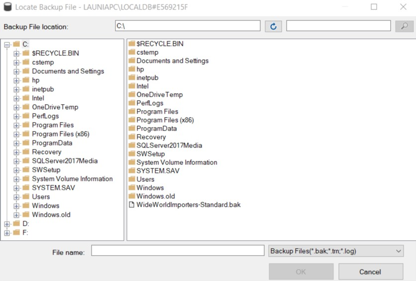

# Homework 6 Blog  
## The Assignment  

Our goal for this assignment were to write an MVC web application that will use portions of a large and complex pre-existing database, derive C# models from and existing database using Entity Framework and "Code First with and Existing Database" workflow, write LINQ queries, and continue using Razor language features to build views.  

We begin the assignment with downloading a pre-existing database (SQL Server's newest example data called World Wide Importers) and restoring it with the use of Microsoft SQL Server Management Studio. 

Here is where the connection is made between sever and Visual Studio (the local database).  

  

Hit connect, give it a few moments and voi-la! Connection is made!  

  

From here right click on "Databases" and select "Restore Database". You will then come to this window below. select "Device" then select the "..." button and then select "Add"

  

You will then see this (after selection "Add")...  

  

Continue with selecting the database (WorldWideImporters).  

** At this point I forgot to take screenshots so I'll continue with explaining the process on what I remember **  

Also make sure to have your Data Source selected to "Microsoft SQL Server". After that you will add your connection and then test the connection. You'll want to do this to make sure that the connection of the database to the application can be made. After this in the Server Explorer you will see a "Tables" folder and when you expand that you should see all of the tables listed (it's quite a list).

### Feature 1 - People Search   

In this section of the assignment we needed to create a web page that would allow users to type in a name (or section of a name) and search the database. This page consits of a search bar and once a search has been submited the results (if there are any) will be displayed in a list below the search bar. This section is fairly similar to steps that were completed in HW 5 in which we needed to create a DAL folder to build the model folder and context file to build our connection to the database. What is done differently later on is that we use LINQ instead of regular SQL to execture the search and select items that are a match to search. This is the dot notation that was discussed in class and this was used in the HomeControll.cs file inside of the ActionResult for the Index (below).  

```
 DisplayModel vm = new DisplayModel();
            if (query == null || query == "")
            {
                ViewBag.show = false;
                return View();
            }
            else
            {
                // display name results in a list
                ViewBag.show = true;
                return View(db.People.Where(x => x.FullName.ToUpper().Contains(query.ToUpper())).ToList());
            }
```

** Index.cshtml - creating the form **

```
<h3 id="searchTitle">Client Search</h3>
    <div class="container-fluid">
        @using (Html.BeginForm("Index", "Home", FormMethod.Get, new { @class = "form-inline" }))
        {
            // creating text input form
            <div class="input-group">
                <span class="input-group-btn">
                    @Html.TextBox("query", null, new { @class = "form-control" })
                    <button class="btn btn-primary" type="submit" id="formbtn">Search</button>
                </span>
            </div>
```  
** in Index.cshtml - when search doesn't have a match, notify user **  
```
 if (Model.Count() == 0)
                {
                    <h4>This client doesn't exists.</h4>
                }
```

** HomeController.cs - display results in a list **  

```
ViewBag.show = true;
                return View(db.People.Where(x => x.FullName.ToUpper().Contains(query.ToUpper())).ToList());
```  

### Feature 2 - Customer Sales Dashboard  

In this section of the assignment we want our users (if they are a customer and essentially the primary contact person) to be able to see details about their company and the sales attached to it from World Wide Importers.  

Below we begin with creating an inner folder within our Model folder to help with managing our queries.  

```
namespace Hmwrk6.Models.ViewModels
{
    public class DisplayModel

    {
        public Person MyPerson { get; set; }
        public Customer MyCustomer { get; set; }
        public List<InvoiceLine> MyInvoiceLine { get; set;}
    }
}
```  

Next, we contiue with the use of dot notation for the queries to find extra information about the company, like its name, phone, fax, etc. Then we show puchases in regaurds to how many were made, the total gross sales, the total profit and lastly the top 10 most profitable items that the customer purchased. I would note that when I run my demo my Purchased Items section displays a lot of extra information that's connected to the company. I tried looking this over with other classmates and with having similar code and calculations we were all unsure as to why there was more information being displayed. I tried cleaning the project and then rebuilding it and running it once again after that and I was still getting the same results. I do also want to note that I did seek help from fellow classmates for this feature as I was struggling with the dot notation and understanding where connections are being made in the database based on the search.

** Details.cshtml - some formating of information, this is also a continuation of using Razor language **
```
<table class="table">
    <div class="person">
        <h3>Person</h3>
        <dl>
            <dt>
                @Html.DisplayNameFor(model => model.MyPerson.FullName)
            </dt>
            <dd>
                @Html.DisplayFor(model => model.MyPerson.FullName)
            </dd>
            <dt>
                @Html.DisplayNameFor(model => model.MyPerson.PreferredName)
            </dt>
            <dd>
                @Html.DisplayFor(model => model.MyPerson.PreferredName)
            </dd>
            .
            .
            .
 @if (ViewBag.Isp)
    {
        @*customer information*@
        <div class="customer">
            <h3>Customer</h3>
            <dl>
                <dt>
                    @Html.DisplayNameFor(model => model.MyCustomer.CustomerName)
                </dt>
                <dd>
                    @Html.DisplayFor(model => model.MyCustomer.CustomerName)
                </dd>
                <dt>
                    @Html.DisplayNameFor(model => model.MyCustomer.PhoneNumber)
                </dt>
                <dd>
                    @Html.DisplayFor(model => model.MyCustomer.PhoneNumber)
                </dd>
                .
                .
                .
 @*gross sales and gross profits*@
        <div class="purchases">
            <h3>Purchases</h3>
            <dl>
                <dt>
                    @Html.Label("order count", "Orders: ")
                </dt>
                <dd>
                    @Html.DisplayFor(model =>model.MyCustomer.Orders.Count)
                </dd>
                <dt>
                    @Html.Label("gross sales","Gross Sales: ")
                </dt>
                <dd>
                    @string.Format("{0:C}", ViewBag.GrossSales)
                </dd>
                <dt>
                    @Html.Label("gross profit", "Gross Profit: ")
                </dt>
                <dd>
                    @string.Format("{0:C}", ViewBag.GrossProfit)
                </dd>
            </dl>
        </div>
        .
        .
        .
```  
** HomeController.cs - were calculations for gross profit, gross sales, etc in regards to feature 2 **  

```
if(vm.MyPerson.Customers2.Count() > 0)
            {
                ViewBag.IsP = true;
                int customerID = vm.MyPerson.Customers2.FirstOrDefault().CustomerID;
                vm.MyCustomer = db.Customers.Find(customerID);

                // the Gross Sales sum
                ViewBag.GrossSales = vm.MyCustomer.Orders.SelectMany(s => s.Invoices).SelectMany(p => p.InvoiceLines).Sum(x => x.ExtendedPrice);
                ViewBag.GrossProfit = vm.MyCustomer.Orders.SelectMany(s => s.Invoices).SelectMany(p => p.InvoiceLines).Sum(x => x.LineProfit);
                vm.MyInvoiceLine = vm.MyCustomer.Orders.SelectMany(y => y.Invoices).SelectMany(z => z.InvoiceLines).OrderByDescending(v => v.LineProfit).Take(10).ToList();
            }

            if(id == null)
            {
                return new HttpStatusCodeResult(HttpStatusCode.BadRequest);
            }

            Person thisPerson = db.People.Find(id);
            if(thisPerson == null)
            {
                return HttpNotFound();
            }
```  

### Feature 3 - Map  

I tried to get this working but I had no such luck sadly. When I would run my demo it looks like the page is leaving a div open for where the map would be displayed but for some reason it isn't showing (at this point there's a possibility I could have missed something very minor in detail that is messing it all up - as I'm sure you already know - but for the time being I have to move on with the rest of the class assignments). Below is what I have for this feature.  

** in Details.cshtml **  

```
@section Header
{
    <link rel="stylesheet" href="https://unpkg.com/leaflet@1.3.4/dist/leaflet.css" integrity="sha512-puBpdR0798OZvTTbP4A8Ix/l+A4dHDD0DGqYW6RQ+9jxkRFclaxxQb/SJAWZfWAkuyeQUytO7+7N4QKrDh+drA==" crossorigin="" />    
    <script src="https://unpkg.com/leaflet@1.3.4/dist/leaflet.js" integrity="sha512-nMMmRyTVoLYqjP9hrbed9S+FzjZHW5gY1TWCHA5ckwXZBadntCNs8kEqAWdrb9O7rxbCaA4lKTIWjDXZxflOcA==" crossorigin=""></script>
}
.
.
.
<div class="col-md-5">
        <div id="map" style="height: 180px"></div>
        <script>
            var long = @Model.MyCustomer.DeliveryLocation.Longitude;
            var lat = @Model.MyCustomer.DeliveryLocation.Latitude;
            var map = L.map('map').setView([lat, long], 13);

            L.tileLayer('https://{s}.tile.openstreetmap.org/{z}/{x}/{y}.png', {
                attribution: '&copy; <a href="https://www.openstreetmap.org/copyright">OpenStreetMap'</a> contributors'}).addTo(map);

            L.marker([51.1, -0.09]).addTo(map).bindPopup('A pretty CSS3 popup.<br> Easily customizable.').openPopup();

        </script>
    </div>
```  

and lastly in the _Layout.cshtml file this short line of Razor  
```
 @RenderSection("Header", required:false)
```  

This assignment was definitly the hardest one for me so far. I was having some difficulty with understanding how to use LINQ and understanding how Razor was being used as well to make connections to the information in our pre-existing database and displaying it in my views. However, I think there was some decent progressed made in that understanding. Any way, that's a wrap! Please feel free to navigate back to my portfolio page and check out the demo for this assignment.
