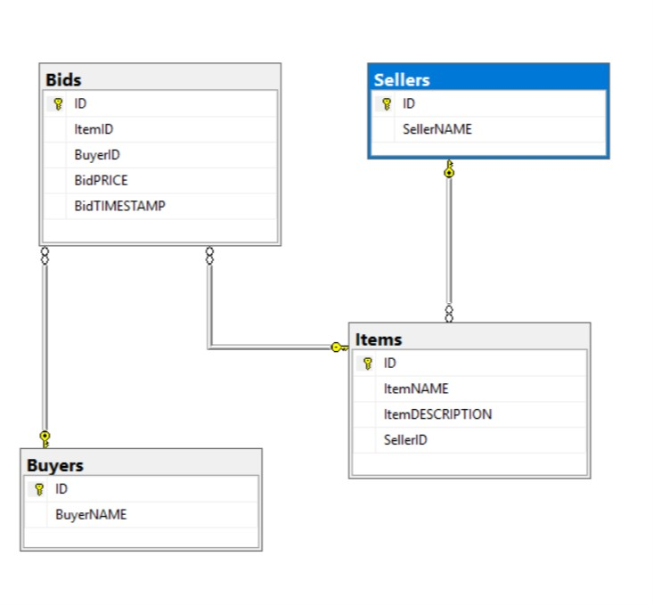
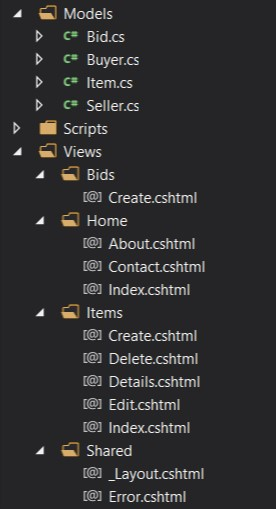

# Homework 8 Blog  
## The Assignment  

Create an MVC web app that uses a multi-table, relational db that we created. We need to be able to create models with foreign keys and navigation properties. Implement CRUD functionality. We are required to use a "Code First with an Existing Database" workflow, use a script to create and populate your tables with some sample data and then create a script that can delete them, and then use strongly typed views and LINQ syntax.  
### Let's Begin  

Begin with creating a new MVC application. Go to your Add_Data folder and create a new database (right click, Add, New Item, SQL Server DB). From there create new SQL queries (up and down sql files - right click on Server Exp. and select New Query). Make sure connection is made to local db. Note: if path doesn't show double click on the mdf file on your Solution Exp.  

up.sql  
```
CREATE TABLE [dbo].[Buyers]
(
	[ID]			INT IDENTITY (1,1)		NOT NULL,
	[BuyerNAME]		NVARCHAR (80)			NOT NULL,
	
	CONSTRAINT [PK_dbo.Buyers] PRIMARY KEY CLUSTERED ([ID] ASC)
);

CREATE TABLE [dbo].[Sellers]
(
	[ID]			INT IDENTITY (1,1)		NOT NULL,
	[SellerNAME]	NVARCHAR (80)			NOT NULL,

	CONSTRAINT [PK_dbo.Sellers] PRIMARY KEY CLUSTERED ([ID] ASC)
);

CREATE TABLE [dbo].[Items]
(
	[ID]				INT IDENTITY (1001,1)		NOT NULL,
	[ItemNAME]			NVARCHAR (100)				NOT NULL,
	[ItemDESCRIPTION]	NVARCHAR (200)				NOT NULL,
	[SellerID]			INT							NOT NULL,

	CONSTRAINT [PK_dbo.Items] PRIMARY KEY CLUSTERED ([ID] ASC),
	CONSTRAINT [FK_dbo.Items] FOREIGN KEY (SellerID) REFERENCES [dbo].[Sellers]([ID])
);

CREATE TABLE [dbo].[Bids]
(
	[ID]			INT IDENTITY (1,1)			NOT NULL,
	[ItemID]		INT 						NOT NULL,
	[BuyerID]		INT 						NOT NULL,
	[BidPRICE]		DECIMAL						NOT NULL,
	[BidTIMESTAMP]	DATETIME					NOT NULL,

	CONSTRAINT [pk_dbo.Bids] PRIMARY KEY CLUSTERED ([ID] ASC),
	CONSTRAINT [FK_dbo.Bids] FOREIGN KEY (ItemID) REFERENCES [dbo].[Items]([ID]),
	CONSTRAINT [FK2_dbo.Bids] FOREIGN KEY (BuyerID) REFERENCES [dbo].[Buyers]([ID])
);

INSERT INTO [dbo].[Buyers] (BuyerNAME) VALUES
	('Jane Stone'),
	('Tom McMasters'),
	('Otto Vanderwall');

INSERT INTO [dbo].[Sellers] (SellerNAME) VALUES
	('Gayle Hardy'),
	('Lyle Banks'),
	('Pearl Greene');

INSERT INTO [dbo].[Items] (ItemNAME, ItemDESCRIPTION, SellerID) VALUES
	('Abraham Lincoln Hammer'    ,'A bench mallet fashioned from a broken rail-splitting maul in 1829 and owned by Abraham Lincoln', 3),
	('Albert Einsteins Telescope','A brass telescope owned by Albert Einstein in Germany, circa 1927', 1),
	('Bob Dylan Love Poems'      ,'Five versions of an original unpublished, handwritten, love poem by Bob Dylan', 2);

INSERT INTO [dbo].[Bids] (ItemID, BuyerID, BidPRICE, BidTIMESTAMP) VALUES
	(1001, 3, 250000, '12/04/2017 09:04:22'),
	(1003, 1, 95000, '12/04/2017 08:44:03');
GO
```  
down.sql  
```
ALTER TABLE Items DROP CONSTRAINT [FK_dbo.Items];
ALTER TABLE Bids DROP CONSTRAINT [FK_dbo.Bids];
ALTER TABLE Bids DROP CONSTRAINT [FK2_dbo.Bids];

DROP TABLE [dbo].[Buyers];
DROP TABLE [dbo].[Sellers];
DROP TABLE [dbo].[Items];
DROP TABLE [dbo].[Bids];
```  

Then using MSSQL you can generate an ER diagram. Open MSSQL up and make the connection to the local db. Then navigate to the database folder and right click the database diagram folder and generate a new diagram. Select all of the tables and MSSQL will create the following ER diagram.  

  

Now you'll need to add in Entity Framework (this process is known).  

After EF is installed let's begin to scaffold. Go to your Model folder and right click. Then select Add, New Item, then specify data (under Visual C#) and then ADO.NET Entity Data Model. This will autogenerate your models for your tables.  

Implement CRUD functionality for the Items View and implement Create for your Bids view folder.  
  

Adding the list that shows 10 most recent bids and their timestamps.  
This code below checks to see if the date matches the present day or is a date earlier. Display timestamp dates if the date is a previous day and for present day just show the time only.  
```
<th>
    <!-- Check to see if timestamp matches the present date or not.-->
    <!-- If is does only show the time and not the present date. If not, include the date with time -->
    @if (bid.BidTIMESTAMP.Date == DateTime.Today)
    {
        @(string.Format("{0:T}", bid.BidTIMESTAMP))
    }
    else
    {
        @Html.DisplayFor(item => bid.BidTIMESTAMP)
    }
</th>
```  

