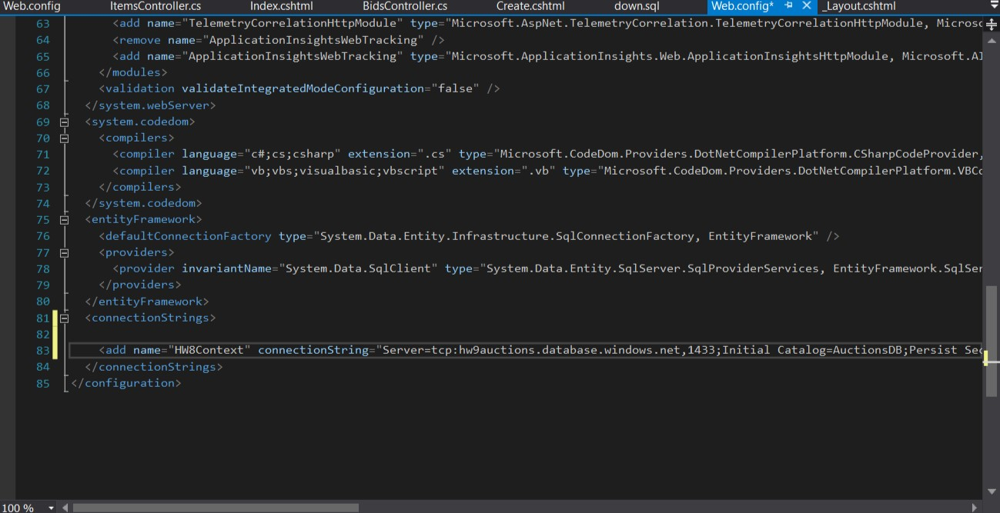

# Homework 9 Blog  
## The Assignment  

Be able to write a complex MVC web application and deploy to the cloud.  
Below is the process in deploying HW8 to the cloud using Azure.  

Step 1 - navigate to Resource Group  
  

Step 2 - add Resource Group then hit Create  
  

Step 3 - create an SQL Database  
  

Step 4 - further process of adding an SQL db  
  

Step 5 - setting up pricing and then hit Create  
  

Step 6 - go to App Services  
  

Step 7 - add a web app through app services  
  

Step 8 - creating web app  
  

Step 9 - give web app name and select from existing  
  

Step 10 - grab the connection string that will be placed in VS MVC app webconfig file  
  

Step 11 - connection string in MVC app - make sure to add user id and password!  
  

Step 12 - App Services and setting the application settings with the connection string and connection string name from webconfig.  
  
  
  
  
  

Step 13 - publishing the app (forgot screen shots)
-in VS go to "Build"  
-select "Publish Hmwk 8"  
-select exisiting  
-publish  
-select the folder  
-then select "OK"  

a url will then be created for the published web app on Azure.  

Final result  
  